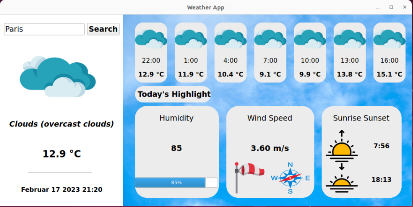

# **Weather App with PyQt and OpenWeather API**

This is a simple weather app created with PyQt and OpenWeather API, which displays current weather information for a given location.

## Requirements

- Python 3.6 or higher
- PyQt5 library
- requests library

## Installation

Clone or download the repository to your local machine. Open the weather_app file in your preferred Python IDE or VS Code IDE.

#### Virtual Environment Setup

#### Install virtualenv pip package

- Install Virtual Environment using pip

  `pip install virtualenv`

  Reference link - https://pypi.org/project/virtualenv/

#### Creating virtual environment

- Create Virtual Environment 'env' as follows in the home path of the repository

  `virtualenv <env_name>`

- If you have multiple python version installed and need to create virtual environment using a specific python version. Then use the following command

  `virtualenv <env_name> -p <path_to_python_folder\python.exe>`

####  Activate the Virtual Environment in Windows

- Use the following command to activate the environment

  `<path_to_environment>\Scripts\activate`

#### Install project dependancies using pip

- Activate the virtual environment in the repository home path and run the below command from project path where requirements.txt is available to install the pip packages.

  `pip install -r requirements.txt`

## Usage

To run the app, simply run the **"weather.py"** file.

- Enter the name of the location you want to check the weather for in the **"Input box"** field.
- Click the **"Search"** button to retrieve the weather information for the entered location.
- The app will display the following information for the selected location:

    - Current temperature
    - Weather description
    - Per hour Forecast temperature 
    - Humidity
    - Wind speed
    - Sunrise time
    - sunset time
    
                                

## APIs Used
This app uses the OpenWeather API to retrieve weather information for a given location.

## License
This project is licensed under the MIT License. See the LICENSE file for more information.

## Acknowledgments
This project was created as a learning exercise and is based on tutorials and documentation from various sources, including:

- PyQt documentation
- OpenWeather API documentation
- Python requests library documentation
